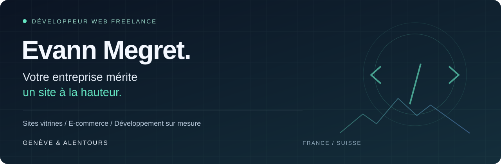

  

<strong>Un design soigné. Une base technique solide. Un site utile à votre activité.</strong>

  <a href="mailto:evann.megret@gmail.com"><strong>Parlons de votre projet ↗</strong></a>

---

### Des sites web pensés pour les entreprises

Je suis **Evann Megret, développeur web freelance**. Je crée des sites web pour les entreprises, indépendants et commerces de **Genève et des alentours, côté France comme côté Suisse**.

Mon objectif : traduire votre savoir-faire en une présence en ligne claire, professionnelle et facile à utiliser. Une interface qui donne confiance, des fonctionnalités adaptées à votre métier et une attention portée aux détails, du premier écran au fonctionnement côté serveur.

<table>
<tr>
<td width="33%" valign="top">
<h3>01 / Sites vitrines</h3>

Présenter votre entreprise, valoriser vos services et faciliter la prise de contact. Une expérience adaptée au mobile comme à l’ordinateur.

</td>
<td width="33%" valign="top">
<h3>02 / E-commerce</h3>

Structurer votre catalogue, concevoir le parcours d’achat et intégrer les outils de paiement et d’administration de votre boutique.

</td>
<td width="33%" valign="top">
<h3>03 / Sur mesure</h3>

Créer les fonctionnalités dont votre activité a besoin : espaces utilisateurs, interfaces de gestion et logique métier.

</td>
</tr>
</table>

### Mes compétences au service de votre projet

| Domaine | Mise en pratique |
| :--- | :--- |
| **Développement web** | Interfaces HTML / CSS, parcours utilisateurs et applications Django |
| **Back-end & données** | Python, modèles de données, administration et logique métier |
| **Intégrations** | Stripe Checkout, webhooks et vérification des paiements côté serveur |
| **Qualité du code** | Tests, gestion des erreurs, versionnement Git et documentation |
| **Fondamentaux** | C, environnement Unix, Shell et Makefile |

### Une collaboration directe

**01 — Comprendre** votre activité, vos clients et les objectifs du site.  
**02 — Concevoir** une structure claire et une identité visuelle cohérente.  
**03 — Développer** les interfaces et les fonctionnalités utiles.  
**04 — Vérifier** les parcours et préparer la mise en ligne.

---

  <strong>Votre prochain site commence par une conversation.</strong> 
  Vous avez un projet de création ou de refonte à Genève ou dans la région franco-suisse ?  
  <a href="mailto:evann.megret@gmail.com"><strong>evann.megret@gmail.com ↗</strong></a>  
  Evann Megret · Développeur web freelance · Genève &amp; alentours · France / Suisse

